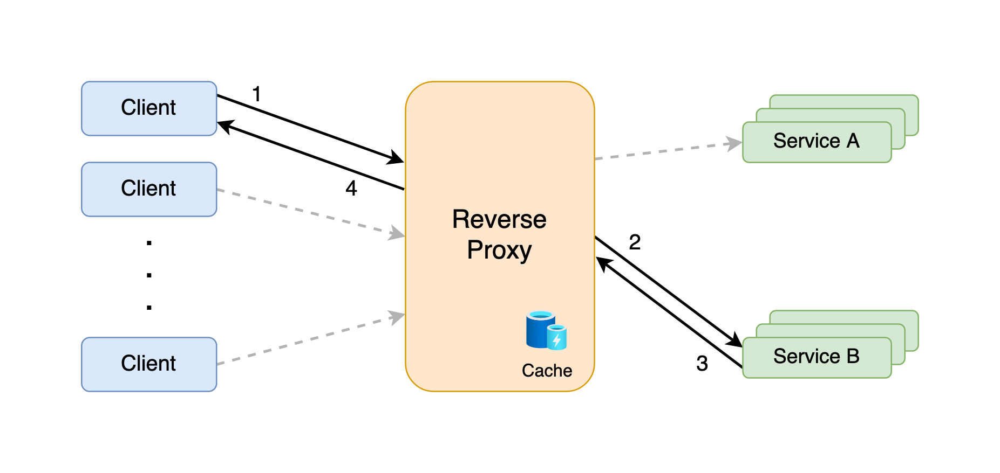
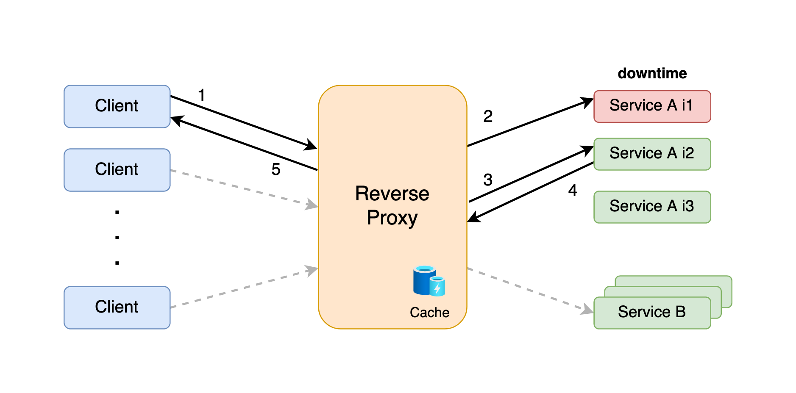
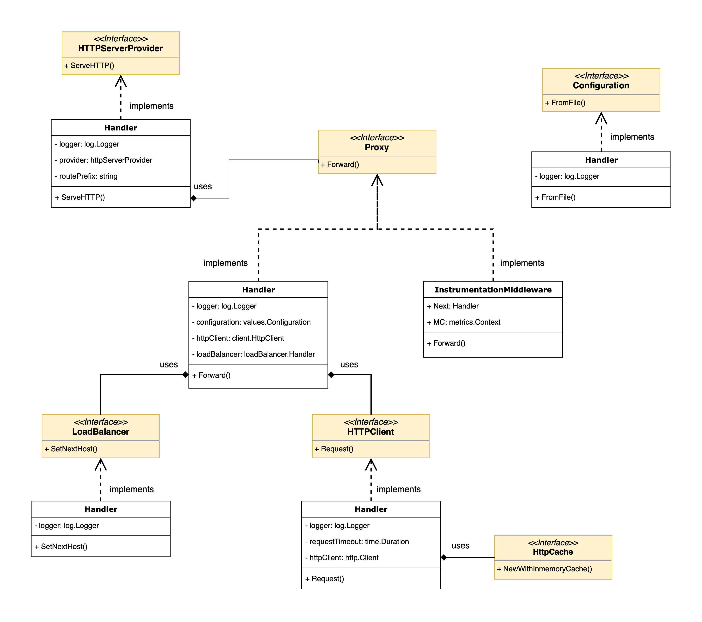
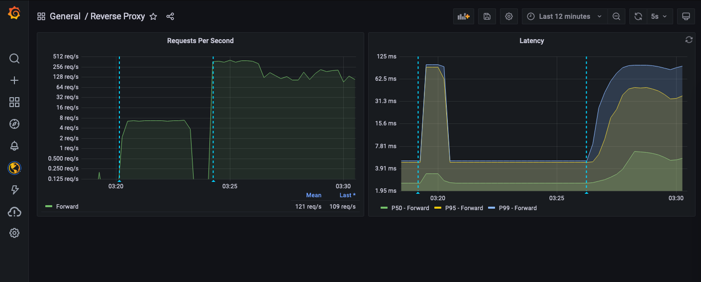

<h1 align="center">
  <br>
  
</h1>

<h4 align="center">A Golang low-latency reverse proxy</h4>

<p align="center">
  <a href="#about">About</a> •
  <a href="#system-design">System Design</a> •
  <a href="#deployment">Deployment</a> •
  <a href="#testing">Testing</a> •
  <a href="#api-usage">API Usage</a> •
  <a href="#slis-and-monitoring">SLIs and Monitoring</a> •
  <a href="#improvements">Improvements</a>
</p>


## About

The `go-reverse-proxy` is a low-latency reverse proxy implementation in Golang, ready to be deployed in any Kubernetes cluster. The configurations are very straightforward and only require a couple environment variables and changing the configuration file in ```proxy-configs/```.


#### Main functionalities include:

- :muscle:  Resilience when facing an outage of a downstream service instance
- :twisted_rightwards_arrows:  Load Balancing that applies a Round-Robin strategy
- :repeat:  Configurable HTTP retries
- :floppy_disk:  Caching of HTTP responses, compliant with HTTP Cache Control - [RFC 7234](https://datatracker.ietf.org/doc/html/rfc7234)
- :arrow_forward:  Deployable Kubernetes [Helm](https://helm.sh/) Chart
- :bar_chart:  Prometheus metrics exporter

<h1 align="center">
  
</h1>


#### Dependencies

- [go-kit](https://github.com/go-kit/kit) - a programming toolkit for building microservices in Go
- [gorilla/mux](https://github.com/gorilla/mux) - request router and dispatcher for matching incoming requests to their respective handler
- [go-retryablehttp](https://github.com/hashicorp/go-retryablehttp) - HTTP client interface with automatic retries and exponential backoff
- [go-yaml](https://github.com/go-yaml/yaml) - comfortably encode and decode YAML values
- [httpcache](https://github.com/bxcodec/httpcache) - simple HTTP cache wrapper


## System Design

### Requirements

The main requirements of the system that defined how it should be designed are:

- It must be resilient to network issues in the proxy->service layer;
- It must be resilient to an outage in a servie intance;
- It must have a very reduced latency;
- A load balancer must be implemented to balance the workload on the service instances;
- Installation and configuration must be extremely simple.

The first two topics were solved by implementing HTTP retries, which result in repetitive attempts to forward the request to a service instance in case of failure. Additionaly, if one instance goes down, the proxy immediately acknowledges this and forwards the request to the next service instance:

<h1 align="center">
  
</h1>

The load balancer logic implements a Round-Robin algorithm which defines, after each request, the next service instance to be used.

Low latency is assured by the HTTP cache, which stores the service responses in-memory for a configurable amount of seconds, before purging the data. When adding this to the fact that the proxy runs in Golang, which has a recognized capability to execute thousands of goroutines with very low impact on the system, makes it so that we can serve thousands of customers concurrently, with a reduced amount of resources.


### Best-Practices

The system was design with the SOLID principles in mind, trying to push for separation of concerns and reduce dependencies between different packages. Packages expose well-defined interfaces with no-more that 2 methods at most.

Data transfer betwen the different modules of the system relies on concise, documented and structured data types, that are used to represent multiple domain entities related to the functionalities, such as the proxy Configuration, or a client Request.

Also, typical good practices were followed, such as good naming conventions, short methods with low complexity and high unit test coverage.

### Business Logic Modules

The image below presents a very simple UML representation of the system, focusing only on the main interfaces, and how they interact with each other.

<h1 align="center">
  
</h1>


## Deployment

### Initial Configuration

1. Create a .env file with the environment variables configuration (the values below represent the default values if no file is created):

```yaml
CONFIGURATION_FILENAME: "proxyConfig.yaml"
MAX_HTTP_RETRIES: 2
MAX_FORWARD_RETRIES: 2
HTTP_CACHE_TTL_SECONDS: 60
METRICS_ADDR: ":8090"
```

2. Add your own service routes to the proxy configuration file which can be found in ```proxy-configs/```:

```yaml
proxy:
  listen:
    address: "127.0.0.1"
    port: 8080
  
  services:
    - name: my-service
      domain: my-service.my-company.com
      hosts:
        - address: "10.0.0.1"
          port: 9090
        - address: "10.0.0.2"
          port: 9090
```


### Local Deployment

There are two ways for deploying the system locally:

```sh
make run
```


### Using docker-compose

```sh
docker-compose run reverse-proxy
```


### Deploying to Kubernetes as a Helm Chart

The service can be easily plugged in a Kubernetes cluster by intalling the respective Helm Chart. The deployment is configured to consume the following resources:

```yaml
resource:
  limits:
    cpu: 600m # maximum CPU that the pod is allowed to request
    memory: 512Mi # maximum memory hat the pod is allowed to request
  requests:
    cpu: 100m # CPU initially allocated to the pod
    memory: 128Mi # Memory initially allocated to the pod
```

1. **Install Minikube for a local Kubernetes cluster**

```console
brew install minikube
```

```sh
minikube start
```

2. **Build the Docker image** 

```sh
eval $(minikube docker-env)
```

```sh
make docker-build
```

3. **Install Helm Chart in the Kubernetes cluster**

```sh
make helm-install
```

Finally, you can see your deployment  and the respective pod by executing:

```shell
kubectl get deployment | grep reverse-proxy
```

```shell
kubectl get pod | grep reverse-proxy
```


## Testing

### Running unit tests

The unit tests of the system can be ran using the command below:

```shell
make unit-test
```


### Running JMeter load test

**Requires**: [Apache JMeter](https://jmeter.apache.org/)

To facilitate testing the service for a large amount of concurrent user requests, I implemented a simple load testing automation that does the following:

1. Runs the reverse proxy service;

2. Runs a service composed of 3 HTTP instances;

3. Executes a JMeter load test simulating 20 concurrent users for a period of 60 seconds.

This automation is executed with the following command:

```shell
make load-test
```


## API Usage

The service contains one endpoint which accepts any HTTP method, path and query parameters. Any path after the ```proxy/``` route will be the destination endpoint where the request will be sent.

```
http://127.0.0.1:8080/proxy/
```

The client identifies the downstream service that he wants to access to, by specifying the ```Host``` HTTP header, which must be a valid service ```domain``` in the proxy configuration file, otherwise he will receive a ```404 - Not Found``` response.

```json
Header: "Host: users.com"
```


#### Example

The next cURL request will result in making a ```GET``` request to the endpoint ```/api/v1/users``` of the service configured with domain ```users.com```, and with the query parameters ```par1=foo``` and ```par2=bar```.

```shell
curl --location --request GET 'http://127.0.0.1:8080/proxy/api/v1/users?par1=foo&par2=bar' \
--header 'Host: users.com'
```

The proxy also supports sending JSON data in the request body, which will be forwarded to the downstream service:

```shell
curl --location --request GET 'http://127.0.0.1:8080/proxy/api/v1/users' \
--header 'Host: users.com' \
--header 'Content-Type: application/json' \
--data-raw '{
    "message": "Hello World!"
}'
```


## SLIs and Monitoring

### Suggested SLIs

- `Request Volume` - total number of requests in a given time range.
- `Latency` -  time elapsed since the proxy receives the client request, until it responds back to him.
- `Request Success Rate` - percentage of non 4xx-5xx status code responses.
- `Request Processing Time` - time elapsed since the client request is read by the proxy, until it is forwarded to the downstream service.
- `Response Processing Time` - time elapsed since the downstream service responds to the proxy, until it is forwarded to the client.
- `Number of Pods` - total number of pods that are up and running in the cluster.

- `% CPU Usage per Pod` - percentage of the CPU resources that are being used.
- `% Memory Usage per Pod` - percentage of the memory resources that are being used.


### Implemented metrics

Two of the metrics listed above were implemented by wrapping the Handler that implements the Proxy interface in a Instrumentation middleware which performs computations and then executes the proxy forwarding function. These metrics are:

- `Request Volume` - Prometheus Counter
- `Latency` - Prometheus Histogram

This data is exported to a secondary HTTP server, running in a separate goroutine, which can be queried by a [Prometheus](https://prometheus.io) server.

```shell
http://127.0.0.1:8090/metrics
```


In order to correctly visualize these metrics, I created a [Grafana](https://grafana.com) dashboard that queries the data from a running Prometheus instance, configured to listen on the reverse proxy metrics endpoint. The image below shows these metrics when executing the load test described in the [Testing chapter](#running-jmeter-load-test) for two distinct scenarios:

1. HTTP cache activated;
2. HTTP cache deactivated;

<h1 align="center">
  <br>
  
</h1>


## Improvements

- Use a hosted Cache system, which will allow to persist the cache data even if the service goes down.
- Perform the load balancing that decides the next service instance in a separate goroutine. This will enable the load balancing to scale for more complex algorithms, but keeping the reduced latency and making sure that it does not impact the time it takes to respond to the client.
- Add e2e tests;
- Improve security clearance and minimize attack vectors by improving the parsing of the request HTTP headers and URL. A lot of research into known attack vectors is described [here](https://github.com/GrrrDog/weird_proxies).

