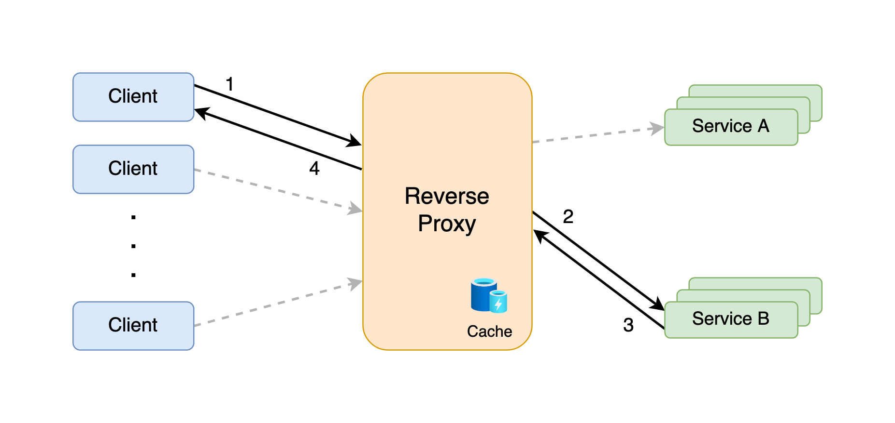
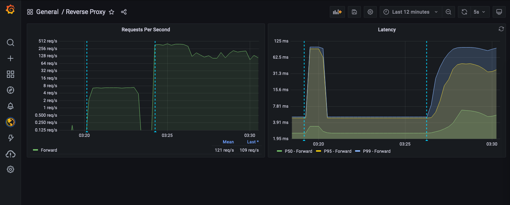

<h1 align="center">
  <br>
  
</h1>

<h4 align="center">A Golang scalable reverse proxy</h4>

<p align="center">
  <a href="#about">About</a> •
  <a href="#architecture-design">Architecture Design</a> •
  <a href="#sli-monitoring">SLI monitoring</a> •
  <a href="#deployment">Deployment</a> •
  <a href="#testing">Testing</a> •
  <a href="#usage">Usage</a>
</p>


## About

The `go-reverse-proxy` is a low-latency reverse proxy implementation in Golang, ready to be deployed in any Kubernetes cluster. The configurations are very straightforward and only require changing the configuration file in ```proxy-configs/``` and executing ```Makefile``` commands.

<h1 align="center">
  <br>
  
</h1>


#### Main functionalities include:

- :muscle:  Resilience when facing an outage of a downstream service instance
- :arrow_forward:  Deployable [Helm](https://helm.sh/) Chart
- :twisted_rightwards_arrows:  Load Balancing that applies a Round-Robin strategy
- :repeat:  Configurable HTTP retries
- :floppy_disk:  Caching of HTTP responses, compliant with HTTP Cache Control - [RFC 7234](https://datatracker.ietf.org/doc/html/rfc7234)
- :bar_chart:  Prometheus metrics exporter


#### Dependencies

- [go-kit](https://github.com/go-kit/kit) - a programming toolkit for building microservices in Go
- [gorilla/mux](https://github.com/gorilla/mux) - request router and dispatcher for matching incoming requests to their respective handler
- [go-retryablehttp](https://github.com/hashicorp/go-retryablehttp) - HTTP client interface with automatic retries and exponential backoff
- [go-yaml](https://github.com/go-yaml/yaml) - comfortably encode and decode YAML values
- [httpcache](https://github.com/bxcodec/httpcache) - simple HTTP cache wrapper


## Architecture Design

The system architecture design can be viewed in the [Architecture Design](docs/architecture.md) doc.


## SLIs and Observability
### Health
- `Uptime`
- `Request Volume` **(Implemented)**
- `Request Success Rate`: percentage of non 4xx-5xx status code responses;

### Resource usage
- `Number of Pods`
- `Network I/0 Usage`
- `% CPU Usage per Pod`
- `% Memory Usage per Pod`
### Performance

- `Request Processing Time`: time elapsed since the client request is read by the proxy, until it is forwarded to the downstream service;
- `Response Processing Time`: time elapsed since the downstream service responds to the proxy, until it is forwarded to the client;
- `Latency`: **(Implemented)** time elapsed since the proxy receives the client request, until it responds back to him.

<h1 align="center">
  <br>
  
</h1>


## Deployment

Steps to deploy the service can be found on the [Deployment](docs/deployment.md) guide.


## Testing

### Running unit tests

The unit tests of the system can be ran using the command below:

```shell
make unit-test
```


### Running JMeter load test

To facilitate testing the service for a large amount of concurrent user requests, I implemented a simple load testing automation that does the following:

1. Runs the reverse proxy service;

2. Runs a service composed of 3 HTTP instances;

3. Executes a JMeter load test simulating 20 concurrent users for a period of 60 seconds.

This automation is executed with the following command:

```shell
make load-test
```


## Usage

