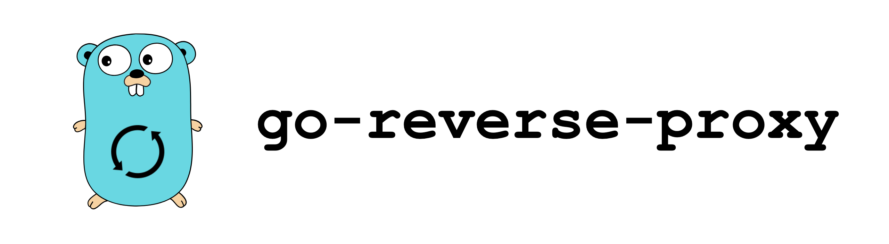

<h1 align="center">
  <br>
  
</h1>

<h4 align="center">A Golang scalable reverse proxy.</h4>

<p align="center">
  <a href="#about">About</a> •
  <a href="#main-dependencies">Main Dependencies</a> •
  <a href="#configuration">Configuration</a> •
  <a href="#test">Test</a> •
  <a href="#deployment">Deployment</a> •
  <a href="#usage">Usage</a>
</p>

---

## About

The `go-reverse-proxy` service is a Golang reverse proxy implementation, completely configured to be deployed in a Kubernetes environment and scale as needed.

## Main dependencies
- [go-kit](https://github.com/go-kit/kit)
- [gorilla/mux](https://github.com/gorilla/mux)
- [go-retryablehttp](https://github.com/hashicorp/go-retryablehttp)
- [go-yaml](https://github.com/go-yaml/yaml)


## Configuration

The template configuration file can be found in [Proxy Config](proxy-configs/proxyConfig.yaml)

```yaml
proxy:

  listen:
    address: "127.0.0.1"
    port: 8080

  services:

    - name: my-service
      domain: my-service.my-company.com
      hosts:
        - address: "10.0.0.1"
          port: 9090
        - address: "10.0.0.2"
          port: 9090
```

## Test
```sh
make test
```

## Deployment

Steps to deploy the service can be found on the [Deployment](docs/deployment.md) doc.


## Usage
