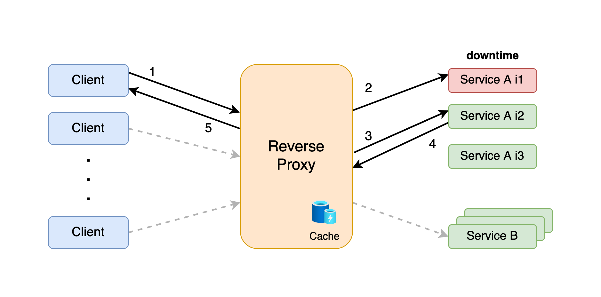

<h1 align="center">Architecture Design</h4>

- HTTP retries
- HTTP Response caching
- Round-Robin Load Balancing
- Service instance downtime recovery

## Managing services downtime

<h1 align="center">
   
  
</h1>